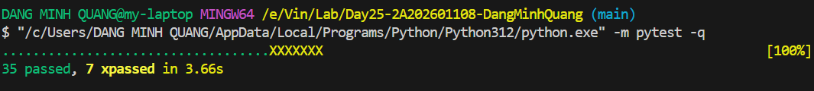

# Day 25 Lab Final Report — Reliability Engineering for Production Agents

## 1. Architecture

```text
User → Reliability Gateway → Privacy-aware semantic cache
                              ├─ hit → cached response
                              └─ miss → Circuit Breaker → Primary
                                                         ├─ error/open → Backup
                                                         └─ all fail → Static fallback
```

The cache uses word tokens plus character 3-gram cosine similarity. Sensitive prompts bypass reads and writes, while mismatched four-digit identifiers are rejected as false hits. Each provider has an independent CLOSED/OPEN/HALF_OPEN circuit breaker.

## 2. Reproducible Configuration

| Setting | Value | Rationale |
|---|---:|---|
| Failure threshold | 3 | Stops sustained failures without tripping on one transient error. |
| Reset timeout | 2 s | Bounds fail-fast duration before a recovery probe. |
| Success threshold | 1 | Closes promptly after a successful half-open probe. |
| Cache TTL | 300 s | Balances reuse against stale responses. |
| Similarity threshold | 0.92 | Conservative threshold reduces semantic false hits. |
| Requests/scenario | 100 | Supports stable percentile estimates. |
| Concurrent workers | 4 | Exercises shared gateway state under parallel load. |
| Random seed | 42 | Reuses the same query sequence in comparisons. |

## 3. Aggregate Metrics and SLOs

| SLI | Target | Actual | Status |
|---|---:|---:|:---:|
| Availability | >= 99% | 100.00% | MET |
| P95 latency | < 2500 ms | 314.61 ms | MET |
| Fallback success | >= 95% | 100.00% | MET |
| Cache hit rate | >= 10% | 53.67% | MET |
| Recovery time | < 5000 ms | 2317.36 ms | MET |

The run processed **300** scenario requests with P50/P95/P99 latencies of **267.54/314.61/318.72 ms**, throughput of **29.57 req/s**, cost of **$0.058918**, and cache savings of **$0.161000**.

## 4. Per-Scenario Chaos Evidence

| Scenario | Injection | Availability | P95 ms | Cache hits | Opens | Result |
|---|---|---:|---:|---:|---:|:---:|
| `primary_timeout_100` | Primary provider fails 100% — all traffic should fallback | 100.00% | 315.75 | 55.00% | 2 | **PASS** |
| `primary_flaky_50` | Primary provider fails 50% — circuit should oscillate | 100.00% | 316.63 | 52.00% | 1 | **PASS** |
| `all_healthy` | Control — both providers have zero injected failures | 100.00% | 232.49 | 54.00% | 0 | **PASS** |

## 5. Controlled Cache Comparison

Both variants use healthy providers, the same seed, request count, query sequence, and worker count. Only `cache.enabled` changes.

| Metric | Without cache | With cache |
|---|---:|---:|
| Availability | 100.00% | 100.00% |
| Latency P50 (ms) | 211.66 | 208.45 |
| Latency P95 (ms) | 237.58 | 237.11 |
| Throughput (req/s) | 18.70 | 42.17 |
| Estimated cost ($) | 0.057720 | 0.024550 |
| Cache hit rate | 0.00% | 56.00% |
| Circuit opens | 0 | 0 |

## 6. Redis Shared-State Evidence

Two independent cache clients use one namespace. One writes and the other reads, proving cross-instance shared state. Redis provides native TTL expiration.

- Redis ping: `True`
- Cross-instance read: `True`
- Stored key: `rl:evidence:15d767c9cd6c`
- TTL after write: `300` seconds
- Stored fields: `{"query": "what are the operating hours for customer service", "response": "[evidence] customer service is available during published hours"}`

## 7. Test Evidence

```text
35 passed, 7 xpassed in 3.66s
```

All standard tests, including six Redis integration tests, passed. Seven TODO tests marked `xfail` unexpectedly passed.



## 8. Failure Analysis and Hardening

Redis semantic lookup scans the namespace, making retrieval O(N). Production should use Redis Search, pgvector, or another vector index. Circuit state is process-local; a distributed breaker should use atomic shared counters. Concurrent execution also means state transitions and memory-cache mutations should be protected by locks or moved to atomic shared storage.

## 9. Reproduction Commands

```bash
docker compose up -d
python -m pytest -q
python scripts/run_chaos.py --config configs/default.yaml --out reports/metrics.json
python scripts/capture_redis_evidence.py
python scripts/generate_report.py --metrics reports/metrics.json --out reports/final_report.md
```
